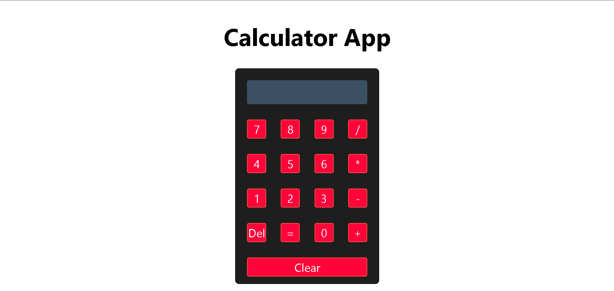
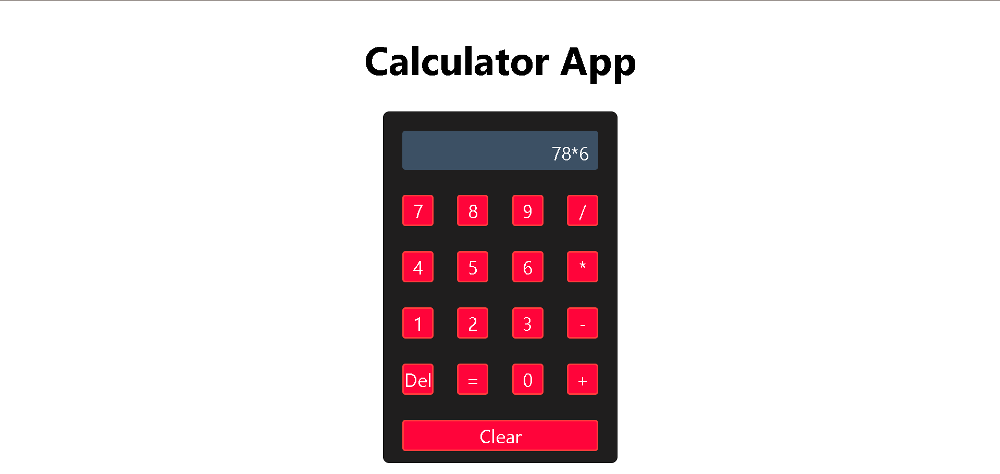
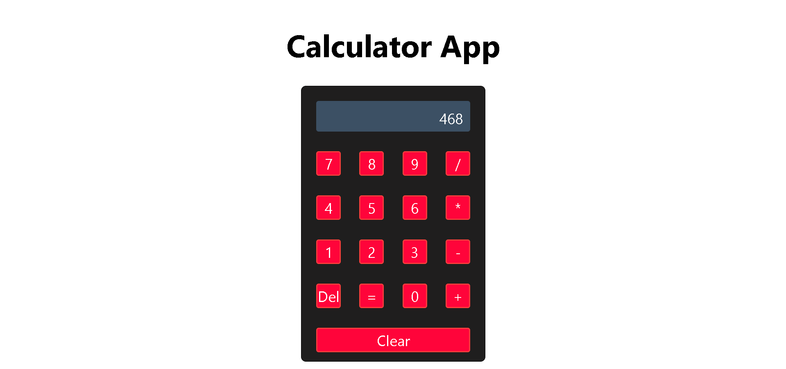
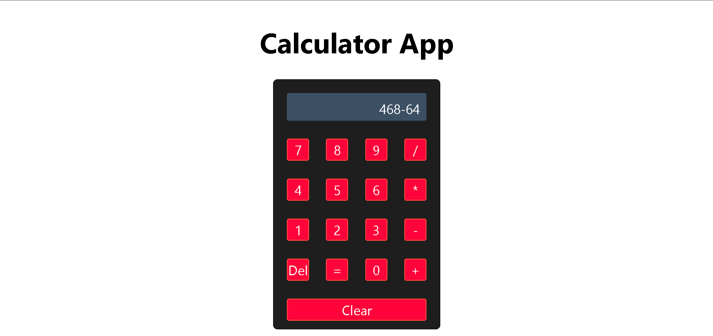
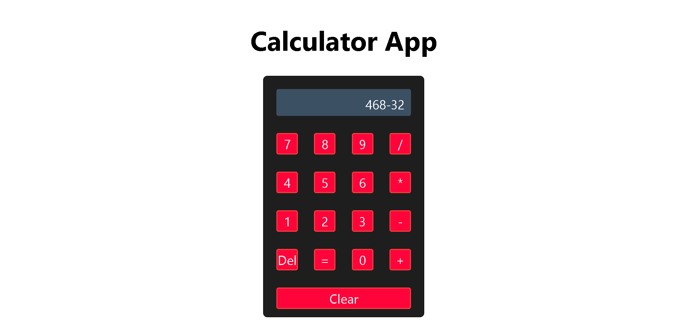
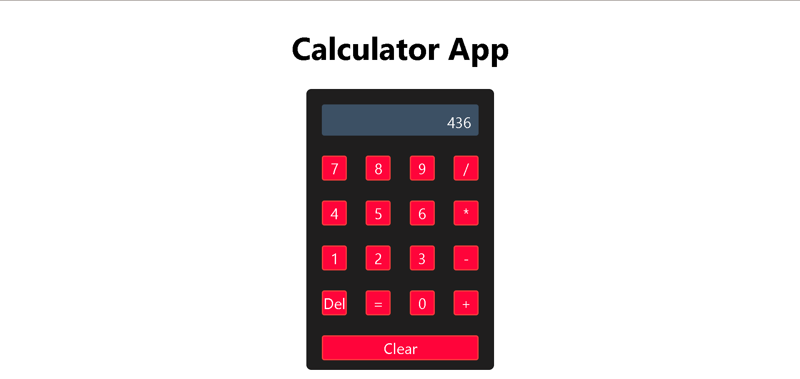

# Calculator App

## Technologies Used

- HTML
- CSS
- JavaScript
- Git and Github

## Description

Calculator App is a simple web calculator that performs basic arithmetic operations. Tap numbers and operators to build an expression, then press `=` to calculate the result. The app also supports delete and clear actions.

This implementation uses [index.html](index.html) for structure, [style.css](style.css) for layout and styling, and [app.js](app.js) for calculator logic.

## Features

- Number buttons `0` through `9`
- Basic operators: `+`, `-`, `*`, `/`
- `=` button to calculate the result
- `Del` button to remove the last entered digit or operator
- `Clear` button to reset the calculator
- Display updates while entering input and after calculations

## User Stories

- As a user, I want to tap numbers so I can build a calculation.
- As a user, I want to tap operators so I can perform addition, subtraction, multiplication, and division.
- As a user, I want to press `=` to view the calculated result.
- As a user, I want a `Del` button so I can fix mistakes without resetting everything.
- As a user, I want a `Clear` button so I can restart my calculation.

## Screenshots

## Future Enhancements

- Add support for decimal numbers.
- Add keyboard input support.
- Support operator chaining and parentheses.
- Add a calculation history display.

## Credits

- Mr. Omar Kamal (https://github.com/omarakamal)
- Mr. Zaid (https://github.com/justzaid)
- Mrs. Israa Ashoor (https://github.com/ISRAA-ASHOOR)
